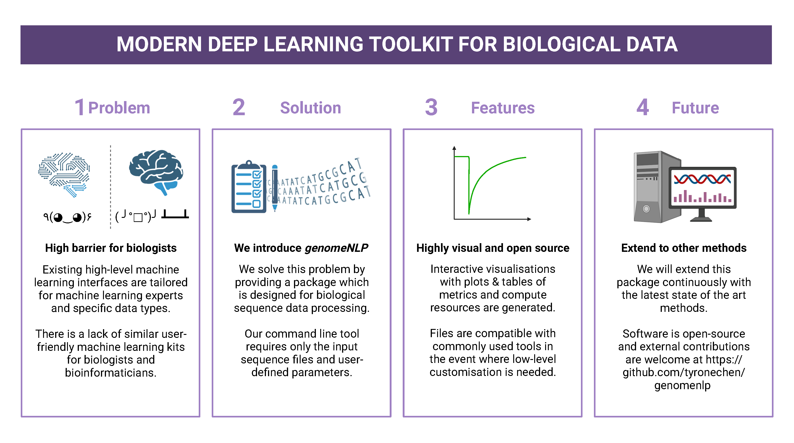

<!-- [](https://doi.org/10.5281/zenodo.4562010) -->
<!-- [](https://hub.docker.com/repository/docker/tyronechen/multiomics) -->
[](https://genomenlp.readthedocs.io/en/latest/)
[](https://opensource.org/licenses/MIT)
[](https://gitlab.com/tyagilab/genomenlp)
[](https://github.com/tyronechen/genomenlp)
[](https://twitter.com/tyagilab)
[](https://doi.org/10.5281/zenodo.8135590)
[](https://biotreasury.rjmart.cn/#/tool?id=77713)
[](https://anaconda.org/tyronechen/genomenlp)
[](https://anaconda.org/tyronechen/genomenlp)
[](https://anaconda.org/tyronechen/genomenlp)
[](https://binderhub.rc.nectar.org.au/v2/gh/tyronechen/genomenlp.git/HEAD?labpath=src%2Fjupyter%2Fcase_study_dna.ipynb)

# genomeNLP - From sequences to words: a computational linguistics toolkit for genomic data.

> **NOTE**: The [main repository is on github](https://github.com/tyronechen/genomenlp) but is also mirrored on [gitlab](https://gitlab.com/tyagilab/genomenlp). Please submit any issues to the main github repository only.

Copyright (c) 2022 <a href="https://orcid.org/0000-0002-9207-0385">Tyrone Chen </a>, <a href="https://orcid.org/0000-0002-8797-3168">Navya Tyagi </a>, Sarthak Chauhan, <a href="https://orcid.org/0000-0002-2296-2126">Anton Y. Peleg </a>, and <a href="https://orcid.org/0000-0003-0181-6258">Sonika Tyagi </a>.

Code in this repository is provided under a [MIT license](https://opensource.org/licenses/MIT). This documentation is provided under a [CC-BY-3.0 AU license](https://creativecommons.org/licenses/by/3.0/au/).

[Visit our lab website here.](https://bioinformaticslab.erc.monash.edu/) Contact Sonika Tyagi at [sonika.tyagi@rmit.edu.au](mailto:sonika.tyagi@monash.edu).

## Highlights

- We provide a comprehensive classification of genomic data tokenisation and representation approaches for ML applications along with their pros and cons.
- Using our ``genomicBERT`` deep learning pipeline, we infer k-mers directly from the data and handle out-of-vocabulary words. At the same time, we achieve a significantly reduced vocabulary size compared to the conventional k-mer approach reducing the computational complexity drastically.
- Our method is agnostic to species or biomolecule type as it is data-driven.
- We enable comparison of trained model performance without requiring original input data, metadata or hyperparameter settings.
- We present the first publicly available, high-level toolkit that infers the grammar of genomic data directly through artificial neural networks.
- Preprocessing, hyperparameter sweeps, cross validations, metrics and interactive visualisations are automated but can be adjusted by the user as needed.



## Cite us with:

*Will be provided on publication (currently in review)*

[A preprint is available, which will be replaced by the publication once online.](https://doi.org/10.1101/2023.05.31.542682)

Cite our manuscript here:

```
@article{chen2023genomicbert,
    title={genomicBERT and data-free deep-learning model evaluation},
    author={Chen, Tyrone and Tyagi, Navya and Chauhan, Sarthak and Peleg, Anton Y and Tyagi, Sonika},
    journal={bioRxiv},
    month={jun},
    pages={2023--05},
    year={2023},
    publisher={Cold Spring Harbor Laboratory},
    doi={10.1101/2023.05.31.542682},
    url={https://doi.org/10.1101/2023.05.31.542682}
}
```

Cite our software here:

```
@software{tyrone_chen_2023_8135591,
    author       = {Tyrone Chen and
                    Navya Tyagi and
                    Sarthak Chauhan and
                    Anton Y. Peleg and
                    Sonika Tyagi},
    title        = {{genomicBERT and data-free deep-learning model 
                    evaluation}},
    month        = jul,
    year         = 2023,
    publisher    = {Zenodo},
    version      = {latest},
    doi          = {10.5281/zenodo.8135590},
    url          = {https://doi.org/10.5281/zenodo.8135590}
}
```

## Install

### Mamba (automated)

This is the recommended install method as it automatically handles dependencies. Note that this has only been tested on a linux operating system. Remember to include the `conda-forge` channel during install or in your anaconda configuration.

> **NOTE**: Installing with `mamba` is highly recommended. Installing with `pip` will not work. Installing with `conda` will be slow. [You can find instructions for setting up mamba here](https://mamba.readthedocs.io/en/latest/installation.html).

First try this:

```
mamba install -c tyronechen -c conda-forge genomenlp
```

If there are any errors with the previous step (especially if you are on a cluster with GPU access), try this first and then repeat the previous step:

```
mamba install -c anaconda cudatoolkit
```

If neither works, please submit an issue with the full stack trace and any supporting information.

### Mamba (manual)

Clone the git repository. This will also allow you to manually run the python scripts.

Then manually install the following dependencies with ``mamba``. Installing with `pip` will not work as some distributions are not available on `pip`.:

```
datasets==2.10.1
gensim==4.2.0
hyperopt==0.2.7
matplotlib==3.5.2
pandas==1.4.2
pytorch==1.10.0
ray-default==1.13.0
scikit-learn==1.1.1
scipy==1.10.1
screed==1.0.5
seaborn==0.11.2
sentencepiece==0.1.96
tabulate==0.9.0
tokenizers==0.12.1
tqdm==4.64.0
transformers==4.23.0
transformers-interpret==0.8.1
wandb==0.13.4
weightwatcher==0.6.4
xgboost==1.7.1
yellowbrick==1.3.post1
```

You should then be able to run the scripts manually from ``src/genomenlp``. As with the automated step, ``cudatoolkit`` may be required.

## Usage

Please refer to the documentation for detailed usage information of the package and the ``genomicBERT`` pipeline.

[](https://genomenlp.readthedocs.io/en/latest/)

## Acknowledgements

TC was supported by an Australian Government Research Training Program (RTP) Scholarship and Monash Faculty of Science Dean’s Postgraduate Research Scholarship. ST acknowledges support from Early Mid-Career Fellowship by Australian Academy of Science and Australian Women Research Success Grant at Monash University. AP and ST acnowledge MRFF funding for the SuperbugAI flagship. This work was supported by the [MASSIVE HPC facility](www.massive.org.au) and the authors thank the Monash Bioinformatics Platform as well as the HPC team at Monash eResearch Centre for their continuous personnel support. We thank Yashpal Ramakrishnaiah for helpful suggestions on package management, code architecture and documentation hosting. We thank Jane Hawkey for advice on recovering deprecated bacterial protein identifier mappings in NCBI. We thank Andrew Perry and Richard Lupat for helping resolve an issue with the python package building process. Biorender was used to create many figures in the associated publication and documentation. We thank Eleanor Cummins for software testing, bug reports, suggested improvements to documentation and contributions to case study. We thank all external contributors to this github repository. [We acknowledge and pay respects to the Elders and Traditional Owners of the land on which our 4 Australian campuses stand](https://www.monash.edu/indigenous-australians/about-us/recognising-traditional-owners).

<!-- > **NOTE**: References are listed in the introduction section. -->
