genomeNLP: Case study of DNA
++++++++++++++++++++++++++++

.. image:: https://binderhub.rc.nectar.org.au/badge_logo.svg
 :target: https://binderhub.rc.nectar.org.au/v2/gh/tyronechen/genomenlp.git/HEAD?labpath=src%2Fjupyter%2Fcase_study_dna.ipynb

4. Setting up a biological dataset
==================================

Understanding of the data and experimental design is a necessary first step to 
analysis. In our case study, we perform a simple two case classification, where 
the dataset consists of a corpora of biological sequence data belonging to two
categories. Genomic sequence associated with promoters and non-promoter regions
are available. In the context of biology, promoters are important modulators of
gene expression, and most are relatively short as well as information rich.
Motif prediction is an active, on-going area of research in biology, since many
of these signals are weak and difficult to detect, as well as varying in 
frequency and distribution across different species. **Therefore, our aim is to 
classify sequences into promoter and non-promoter sequence categories**.

.. NOTE::

  `A more detailed description of the data is available here.
  <https://github.com/khanhlee/bert-promoter>`__

Our data is available in the form of ``fasta`` files. ``fasta`` files are a common 
format for storing biological sequence data. They typically contain headers that 
provide information about the sequence, followed by  the sequence itself. They can 
also store other nucleic acid data, as well as protein. The ``fasta`` format contains 
headers with a leading ``>``. Lines without ``>`` contain biological sequence data 
and can be newline separated. In our simple example, the full set of characters are 
the DNA nucleotides adenine ``A``, thymine ``T``, cytosine ``C`` and guanine ``G``. 
These are the building blocks of the genetic code.

The files can be downloaded here for `non promoter sequences`_ and `promoter sequences`_.

.. _non promoter sequences: https://raw.githubusercontent.com/khanhlee/bert-promoter/main/data/non_promoter.fasta

.. _promoter sequences: https://raw.githubusercontent.com/khanhlee/bert-promoter/main/data/promoter.fasta

.. code-block:: bash

      # create the directory structure
      cd ~
      mkdir -p data src results
      cd data
      curl -L -O "https://raw.githubusercontent.com/khanhlee/bert-promoter/main/data/non_promoter.fasta"
      curl -L -O "https://raw.githubusercontent.com/khanhlee/bert-promoter/main/data/promoter.fasta"
      gzip non_promoter.fasta
      gzip promoter.fasta

.. code-block:: text

      HEADER:   >PCK12019 FORWARD 639002 STRONG
      SEQUENCE: TAGATGTCCTTGATTAACACCAAAAT
      HEADER:   >ECK12066 REVERSE 3204175 STRONG
      SEQUENCE: AAAGAAAATAATTAATTTTACAGCTG

.. NOTE::

  *In real world  data, other characters are available which refer to multiple possible
  nucleotides, for example ``W`` indicates either an ``A`` or a ``T``. RNA includes
  the character ``U``, and proteins include additional letters of the alphabet.*

Tokenisation in genomics involves segmenting biological sequences into smaller
units, called tokens (or k-mers in biology) for further processing. 
In the context of genomics, tokens can represent individual nucleotides, 
k-mers, codons, or other biologically meaningful segments. Just as in conventional NLP, 
tokenisation is required to facilitate most downstream operations.

Here, we provide gzipped fasta file(s) as input. While conventional biological
tokenisation splits a sequence into arbitrary-length segments, empirical 
tokenisation derives the resulting tokens directly from the corpus, 
with vocabulary size as the only user-defined parameter. 
Data is then split into training, testing and/or validation partitions
as desired by the user and automatically reformatted for input into the
deep learning pipeline.

.. NOTE::

  `We provide the conventional k-merisation method as well as an option for users.
  In our pipeline specifically, the empirical tokenisation and data object 
  creation is split into two steps, while k-merisation combines both in one
  operation. This is due to the empirical tokenisation process having to
  "learn" tokens from the data.`

.. code-block:: bash

      # Empirical tokenisation pathway
      cd ~/src
      tokenise_bio \
        -i ../data/promoter.fasta.gz \
           ../data/non_promoter.fasta.gz \
        -t ../data/tokens.json
      # -i INFILE_PATHS path to files with biological seqs split by line
      # -t TOKENISER_PATH path to tokeniser.json file to save or load data

This generates a ``json`` file with tokens and their respective weights or IDs.
You should see some output like this.

.. code-block:: text

      [00:00:00] Pre-processing sequences
      [00:00:00] Suffix array seeds
      [00:00:14] EM training
      Sample input sequence: AACCGGTT
      Sample tokenised: [156, 2304]
      Token: : k-mer map: 156  : : AA
      Token: : k-mer map: 2304 : : CCGGTT

5. Format a dataset for input into genomeNLP
============================================

In this section, we reformat the data to meet the requirements
of our pipeline which takes specifically structured inputs. This
intermediate data structure serves as the foundation for downstream
analyses and facilitates seamless integration with the pipeline.
Our pipeline contains a method that performs this automatically, generating a
reformatted dataset with the desired structure. 

.. NOTE::

  *The data format is identical to that used by the HuggingFace
  ``datasets`` and ``transformers`` libraries.*

.. code-block:: bash

      # Empirical tokenisation pathway
      create_dataset_bio \
        ../data/promoter.fasta.gz \
        ../data/non_promoter.fasta.gz \
        ../data/tokens.json \
        -o ../data/
      # -o OUTFILE_DIR write dataset to directory as 
      #   [ csv \| json \| parquet \| dir/ ] (DEFAULT:"hf_out/")
      # default datasets split: train 90%, test 5% and validation set 5%

The output is a reformatted dataset containing the same information.
Properties required for a typical machine learning pipeline are added,
including labels, customisable data splits and token identifiers.

.. code-block:: text

      DATASET AFTER SPLIT:
      DatasetDict ({
        train: Dataset ({
        features: ['idx', 'feature', 'labels', 'input_ids', 'token_type_ids', 'attention_mask’],
        num_rows: 12175 })
        test: Dataset ({
        features: ['idx', 'feature', 'labels', 'input_ids', 'token_type_ids', 'attention_mask’],
        num_rows: 677 })
        valid: Dataset ({
        features: ['idx', 'feature', 'labels', 'input_ids', 'token_type_ids', 'attention_mask’],
        num_rows: 676 })
      })

.. NOTE::

  *The column ``token_type_ids`` is not actually needed in this 
  specific case study, but it is safely ignored in such cases.*

.. code-block:: text

    SAMPLE TOKEN MAPPING FOR FIRST 5 TOKENS IN SEQ:
    TOKEN ID: 858  | TOKEN: TCA
    TOKEN ID: 2579 | TOKEN: GCATCAC
    TOKEN ID: 111  | TOKEN: TATT
    TOKEN ID: 99   | TOKEN: CAGG
    TOKEN ID: 777  | TOKEN: AGGCT

6. Preparing a hyperparameter sweep
===================================

In machine learning, achieving optimal model performance often requires
finding the right combination of hyperparameters (assuming the input
data is viable). Hyperparameters vary depending on the specific 
algorithm and framework being used, but commonly include learning rate, 
dropout rate, batch size, number of layers and optimiser choice. 
These parameters heavily influence the learning process and subsequent 
performance of the model. 

For this reason, hyperparameter sweeps are normally carried out to 
systematically test combinations of hyperparameters, with the end goal of 
identifying the configuration that produces the best model performance.
Usually, sweeps are carried out on a small partition of the data only
to maximise efficiency of compute resources, but it is not uncommon to
perform sweeps on entire datasets. Various strategies, 
such as grid search, random search, or bayesian optimisation, can be 
employed during a hyperparameter sweep to sample parameter values.
Additional strategies such as early stopping can also be used.

To streamline the hyperparameter optimization process, we use the
``wandb`` (Weights & Biases) platform which has a user-friendly interface
and powerful tools for tracking experiments and visualising results.

First, sign up for a wandb account at: https://wandb.ai/site and login
by pasting your API key.

.. code-block:: bash

    wandb login
    wandb: Paste an API key from your profile, and hit enter and hit enter or press ctrl+c to quit:

Now, we use the ``sweep`` tool to perform hyperparameter sweep. Search
strategy, parameters and search space are passed in as a ``json`` file.
An example is below. If no sweep configuration is provided, default configuration will apply.

.. raw:: html

   

   
<a>Default hyperparameter sweep settings if none are provided. You can copy this file and edit it for your own use if needed.</a>

.. code-block:: json

  {
      "name": "random",
      "method": "random",
      "metric": {
          "name": "eval/f1",
          "goal": "maximize"
          },
      "parameters": {
          "epochs": {
              "values": [1, 2, 3, 4, 5]
              },
          "dropout": {
            "values": [0.15, 0.2, 0.25, 0.3, 0.4]
          },
          "batch_size": {
              "values": [8, 16, 32, 64]
              },
          "learning_rate": {
              "distribution": "log_uniform_values",
              "min": 1e-5,
              "max": 1e-1
          },
          "weight_decay": {
              "values": [0.0, 0.1, 0.2, 0.3, 0.4, 0.5]
          },
          "decay": {
              "values": [1e-5, 1e-6, 1e-7]
          },
          "momentum": {
              "values": [0.8, 0.9, 0.95]
          }
      },
      "early_terminate": {
          "type": "hyperband",
          "s": 2,
          "eta": 3,
          "max_iter": 27
      }
  }

.. raw:: html

   

.. code-block:: bash

    sweep \
      ../data/train.parquet \
      parquet \
      ../data/tokens.json \
      -t ../data/test.parquet \
      -v ../data/valid.parquet \
      -w ../data/hyperparams.json \   # optional
      -e entity_name \       # <- edit as needed
      -p project_name \      # <- edit as needed
      -l labels \
      -n 3
    # -t TEST, path to [ csv \| csv.gz \| json \| parquet ] file
    # -v VALID, path to [ csv \| csv.gz \| json \| parquet ] file
    # -w HYPERPARAMETER_SWEEP, run a hyperparameter sweep with config from file
    # -e ENTITY_NAME, wandb team name (if available).
    # -p PROJECT_NAME, wandb project name (if available)
    # -l LABEL_NAMES, provide column with label names (DEFAULT: "").
    # -n SWEEP_COUNT, run n hyperparameter sweeps

.. code-block:: text

    *****Running training*****
    Num examples = 12175
    Num epochs= 1
    Instantaneous batch size per device = 64
    Total train batch size per device = 64
    Gradient Accumulation steps= 1
    Total optimization steps= 191

The output is written to the specified directory, in this case
``sweep_out`` and will contain the output of a standard ``pytorch`` 
saved model, including some ``wandb`` specific output.

.. add sample output here

The sweeps gets synced to the ``wandb`` dashboard along with various
interactive custom charts and tables which we provide as part of our
pipeline. A small subset of plots are provided for reference. 
Interactive versions of these and more plots are available on wandb.

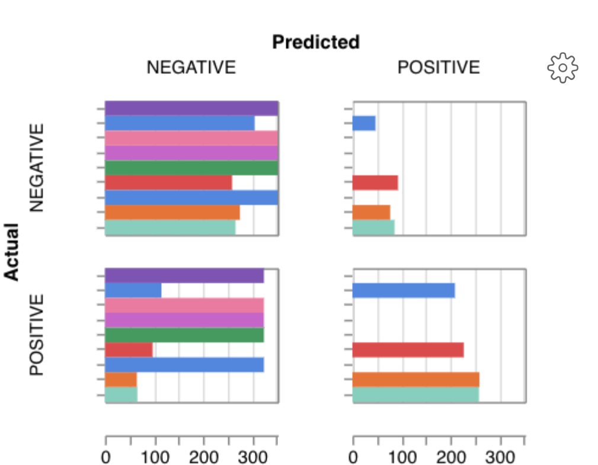

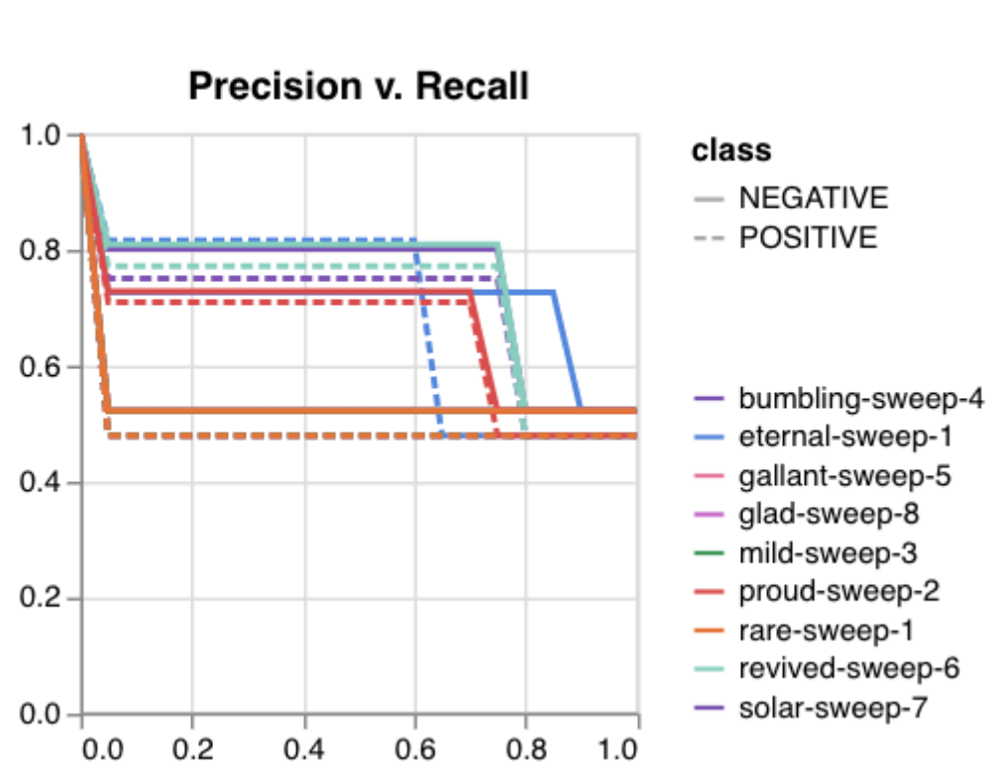

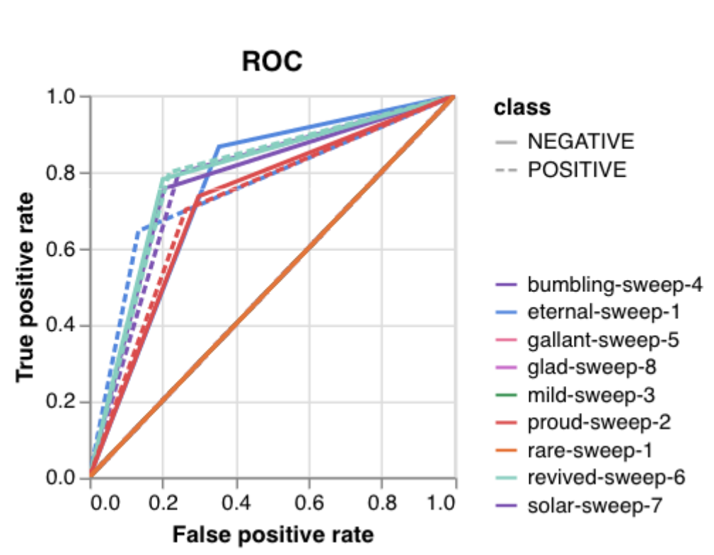

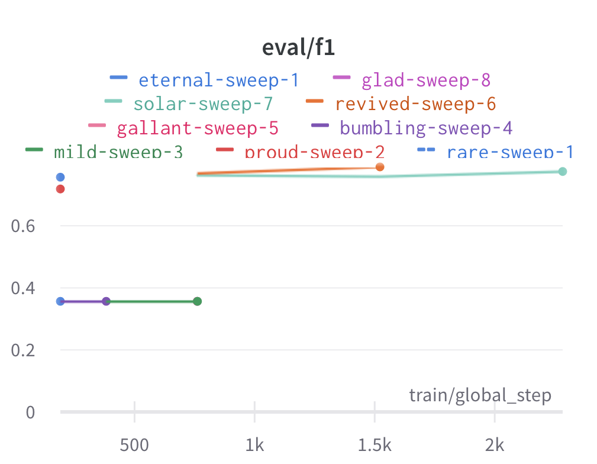

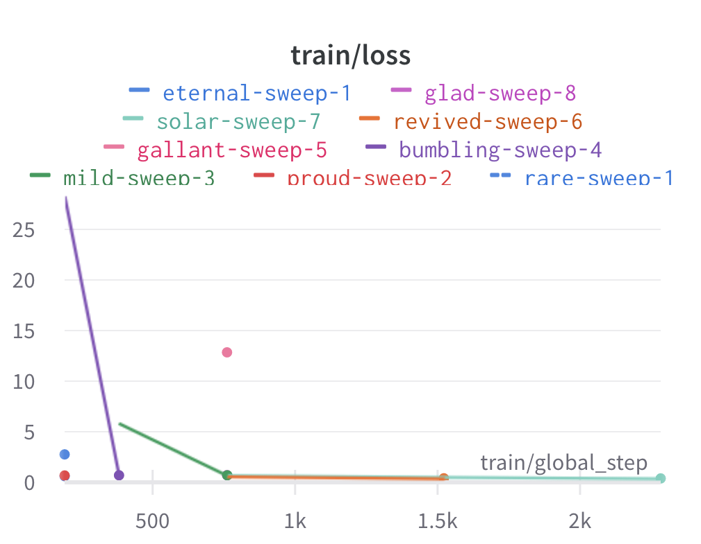

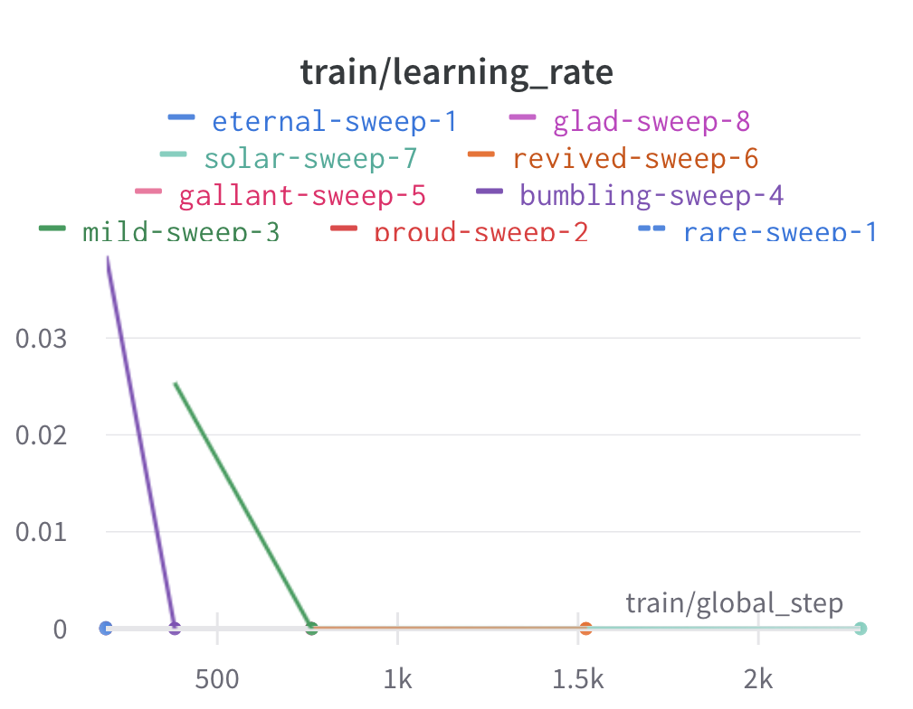

`Here is an example of a full wandb generated report:
<https://api.wandb.ai/links/tyagilab/a56uxmff>`__

You may inspect your own generated reports after they complete.

.. add explanation of report

7. Selecting optimal hyperparameters for training
=================================================

Having completed a sweep, we next identified the best set
of parameters for model training. We do this by examining training metrics.
These serve as quantitative measures of a model's performance during 
training. These metrics provide insights into the model's accuracy and 
generalisation capabilities. We explore commonly used training metrics, 
including accuracy, loss, precision, recall, and f1 score to inform us
of a model's performance

A key event we want to avoid is overfitting. Overfitting occurs when a 
learning model performs exceptionally well on the training data but 
fails to generalise to unseen data, making it unfit for use outside of the 
specific scope of the experiment. This can be detected by observing performance
metrics, if the accuracy decreases and later increases an overfit
event has occurred. In real world applications, this can 
lead to adverse events that directly impact us, considering that such
models are used in applications such as drug prediction or self-driving cars.
Here, we use the f1 score calculated on the testing set as the main 
metric of interest. We showed that we obtain a best ``f1`` score of ``0.79``.

.. code-block:: text

    Best run revived-sweep-6 with eval/f1=0.7900291349379833
    BEST MODEL AND CONFIG FILES SAVED TO: *./sweep_out/model_files*
    HYPERPARAMETER SWEEP END

`Here is an example of a full wandb generated report for the "best" run.
<https://wandb.ai//tyagilab/sweep/reports/Best-run-revived-sweep-6--Vmlldzo0OTExOTc1>`__

You may inspect your own generated reports after they complete.

.. add explanation of report

8. With the selected hyperparameters, train the full dataset
============================================================

In a conventional workflow, the sweep is performed on a small
subset of training data. The resulting parameters are then
recorded and used in the actual training step on the full dataset.
Here, we perform the sweep on the entire dataset, and hence
remove the need for further training. If you perform this on your
own data and want to use a small subset, you can do so and then
pass the recorded hyperparameters with the same input data to 
the ``train`` function of the pipeline. We include an example of 
this below for completeness, but you can skip this for our 
specific case study. Note that the input is almost identical to 
``sweep``.

.. code-block:: bash

    train \
      ../data/train.parquet \
      parquet \
      ../data/tokens.json \
      -t ../data/test.parquet \
      -v ../data/valid.parquet \
      --output_dir ../results/train_out \
      -f ../data/hyperparams.json \  # <- you can pass in hyperparameters
      -c entity_name/project_name/run_id \  # <- wandb overrides hyperparameters
      -e entity_name \   # <- edit as needed
      -p project_name    # <- edit as needed
    # -t TEST, path to [ csv \| csv.gz \| json \| parquet ] file
    # -v VALID, path to [ csv \| csv.gz \| json \| parquet ] file
    # -w HYPERPARAMETER_SWEEP, run a hyperparameter sweep with config from file
    # -e ENTITY_NAME, wandb team name (if available).
    # -p PROJECT_NAME, wandb project name (if available)
    # -l LABEL_NAMES, provide column with label names (DEFAULT: "").

.. NOTE::

  *Remove the ``-e entity_name`` line if you do not have a group setup in wandb*

.. raw:: html

   

   
<a>The contents of hyperparams.json, the file with the best hyperparameters identified by the sweep.</a>

.. code-block:: json

  {
    "output_dir": "./sweep_out/random",
    "overwrite_output_dir": false,
    "do_train": false,
    "do_eval": true,
    "do_predict": false,
    "evaluation_strategy": "epoch",
    "prediction_loss_only": false,
    "per_device_train_batch_size": 16,
    "per_device_eval_batch_size": 16,
    "per_gpu_train_batch_size": null,
    "per_gpu_eval_batch_size": null,
    "gradient_accumulation_steps": 1,
    "eval_accumulation_steps": null,
    "eval_delay": 0,
    "learning_rate": 7.796477400405317e-05,
    "weight_decay": 0.5,
    "adam_beta1": 0.9,
    "adam_beta2": 0.999,
    "adam_epsilon": 1e-08,
    "max_grad_norm": 1.0,
    "num_train_epochs": 2,
    "max_steps": -1,
    "lr_scheduler_type": "linear",
    "warmup_ratio": 0.0,
    "warmup_steps": 0,
    "log_level": "passive",
    "log_level_replica": "passive",
    "log_on_each_node": true,
    "logging_dir": "./sweep_out/random/runs/out",
    "logging_strategy": "epoch",
    "logging_first_step": false,
    "logging_steps": 500,
    "logging_nan_inf_filter": true,
    "save_strategy": "epoch",
    "save_steps": 500,
    "save_total_limit": null,
    "save_on_each_node": false,
    "no_cuda": false,
    "use_mps_device": false,
    "seed": 42,
    "data_seed": null,
    "jit_mode_eval": false,
    "use_ipex": false,
    "bf16": false,
    "fp16": false,
    "fp16_opt_level": "O1",
    "half_precision_backend": "auto",
    "bf16_full_eval": false,
    "fp16_full_eval": false,
    "tf32": null,
    "local_rank": -1,
    "xpu_backend": null,
    "tpu_num_cores": null,
    "tpu_metrics_debug": false,
    "debug": [],
    "dataloader_drop_last": false,
    "eval_steps": null,
    "dataloader_num_workers": 0,
    "past_index": -1,
    "run_name": "./sweep_out/random",
    "disable_tqdm": false,
    "remove_unused_columns": false,
    "label_names": null,
    "load_best_model_at_end": true,
    "metric_for_best_model": "loss",
    "greater_is_better": false,
    "ignore_data_skip": false,
    "sharded_ddp": [],
    "fsdp": [],
    "fsdp_min_num_params": 0,
    "fsdp_transformer_layer_cls_to_wrap": null,
    "deepspeed": null,
    "label_smoothing_factor": 0.0,
    "optim": "adamw_hf",
    "adafactor": false,
    "group_by_length": false,
    "length_column_name": "length",
    "report_to": [
      "wandb"
    ],
    "ddp_find_unused_parameters": null,
    "ddp_bucket_cap_mb": null,
    "dataloader_pin_memory": true,
    "skip_memory_metrics": true,
    "use_legacy_prediction_loop": false,
    "push_to_hub": false,
    "resume_from_checkpoint": null,
    "hub_model_id": null,
    "hub_strategy": "every_save",
    "hub_token": "<HUB_TOKEN>",
    "hub_private_repo": false,
    "gradient_checkpointing": false,
    "include_inputs_for_metrics": false,
    "fp16_backend": "auto",
    "push_to_hub_model_id": null,
    "push_to_hub_organization": null,
    "push_to_hub_token": "<PUSH_TO_HUB_TOKEN>",
    "mp_parameters": "",
    "auto_find_batch_size": false,
    "full_determinism": false,
    "torchdynamo": null,
    "ray_scope": "last",
    "ddp_timeout": 1800
  }

.. raw:: html

   

The output is written to the specified directory, in this case
``train_out`` and will contain the output of a standard ``pytorch`` 
saved model, including some ``wandb`` specific output.

The trained model gets synced to the ``wandb`` dashboard along with 
various interactive custom charts and tables which we provide as part 
of our pipeline. A small subset of plots are provided for reference. 
Interactive versions of these and more plots are available on wandb.

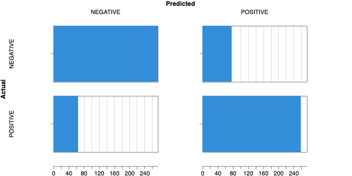

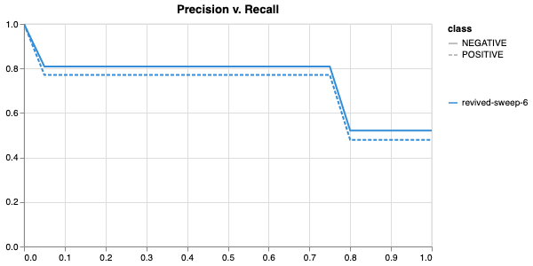

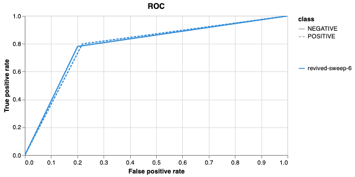

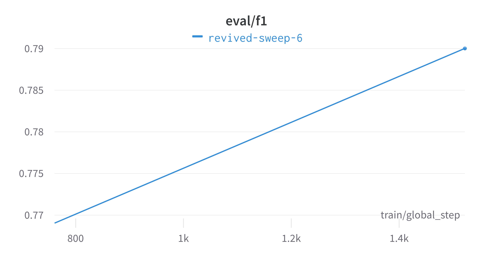

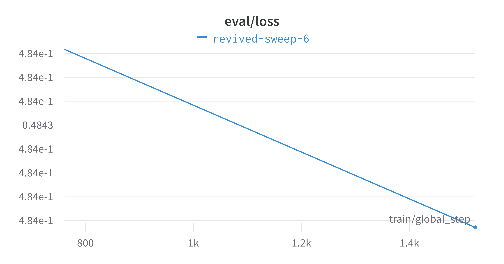

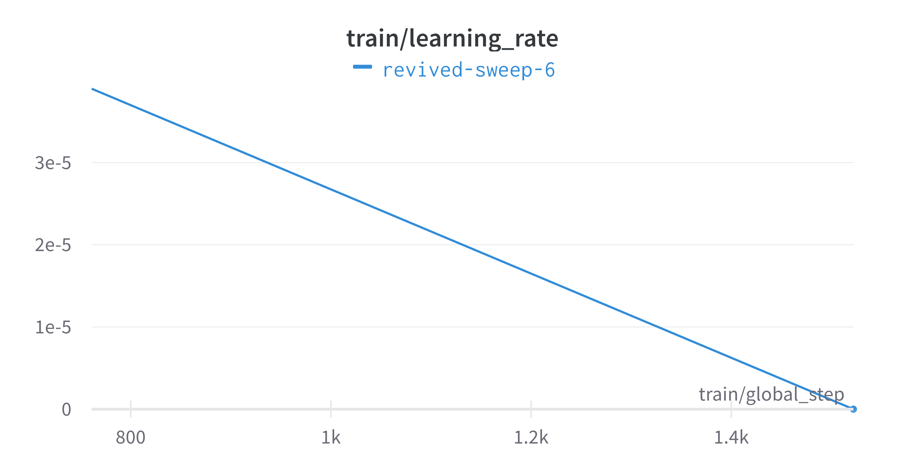

`Here is an example of a full wandb generated report:
<https://wandb.ai/tyagilab/sweep/reports/Best-run-revived-sweep-6--Vmlldzo0OTExOTc1>`__

You may inspect your own generated reports after they complete.

9. Perform cross-validation
===========================

Having identified the best set of parameters and trained the model, we 
next want to conduct a comprehensive review of data stability, and
we do this by evaluating model performance across different data slices. 
This assessment is known as cross-validation. We make use of k-fold
cross-validation in which data is divided into k subsets and
the model is trained and tested on these individual subsets.

.. code-block:: bash

    cross_validate \
      ../data/train.parquet parquet \
      -t ../data/test.parquet \
      -v ../data/valid.parquet \
      -e entity_name \              # <- edit as needed
      -p project_name \             # <- edit as needed
      --config_from_run p9do3gzl \  # id OR directory of best performing run
      --output_dir ../results/cv \
      -m ../results/sweep_out \     # <- overridden by --config_from_run
      -l labels \
      -k 8
    # --config_from_run WANDB_RUN_ID, *best run id*
    # –-output_dir OUTPUT_DIR
    # -l label_names
    # -k KFOLDS, run n number of kfolds

    cross_validate \
      ../data/train.parquet parquet \
      -t ../data/test.parquet \
      -v ../data/valid.parquet \
      -e tyagilab \              
      -p foobar \                
      -c tyagilab/foobar/kixu82co \  
      -o ../results/cv \
      -m ../results/sweep_out \
      -l labels \
      -k 8

.. NOTE::

  *If both ``model_path`` and ``config_from_run`` are specified, ``config_from_run`` overrides*

.. NOTE::

  *Remove the ``-e entity_name`` line if you do not have a group setup in wandb*

.. code-block:: text

    *****Running training*****
    Num examples = 10653
    Num epochs= 2
    Instantaneous batch size per device = 16
    Total train batch size (w, parallel, distributed & accumulation)= 16
    Gradient Accumulation steps= 1
    Total optimization steps= 1332
    Automatic Weights & Biases logging enabled

The cross-validation runs are uploaded to the ``wandb`` dashboard along 
with various interactive custom charts and tables which we provide as 
part of our pipeline. These are conceptually identical to those generated 
by ``sweep`` or ``train``. A small subset of plots are provided for reference. 
Interactive versions of these and more plots are available on wandb.

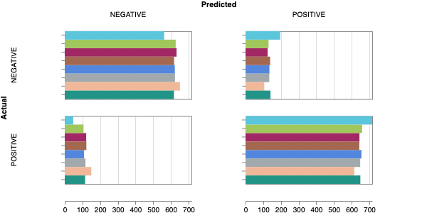

.. image:: fig/dna/cval_pr.png

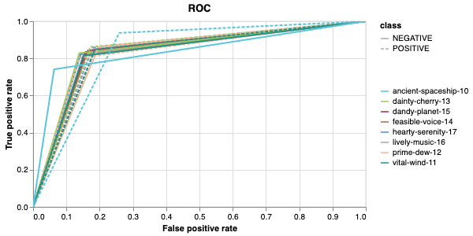

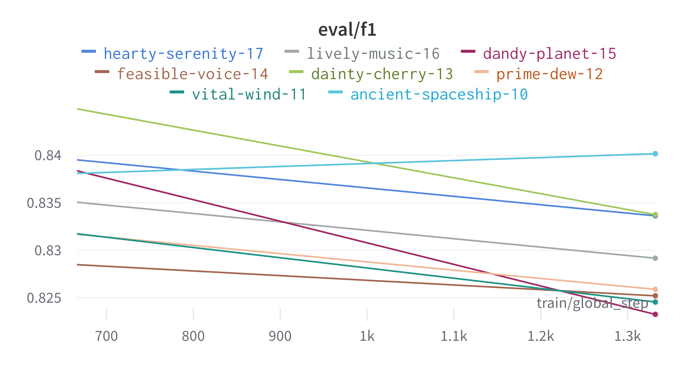

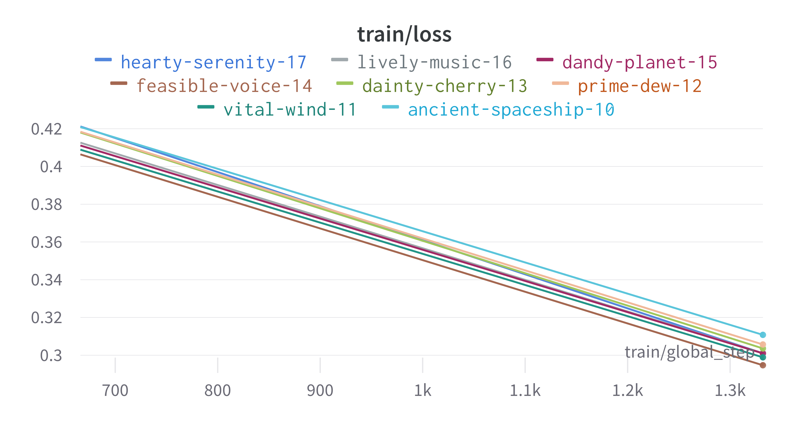

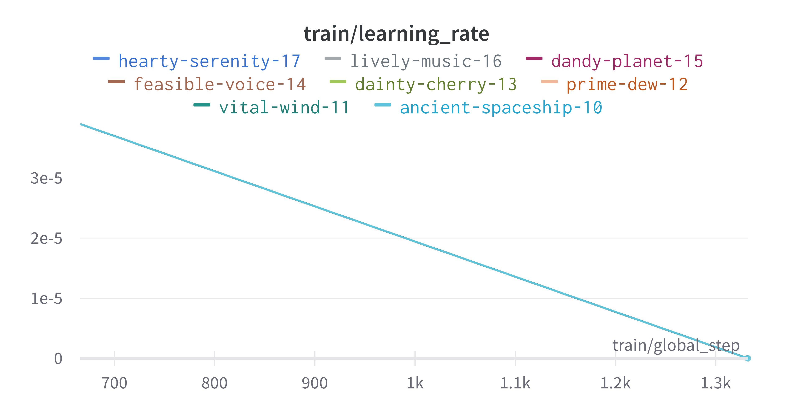

`Here is an example of a full wandb generated report:
<https://api.wandb.ai/links/tyagilab/8vony79x>`__

You may inspect your own generated reports after they complete.

10. Compare different models
============================

The aim of this step is to compare performance of different deep
learning models efficiently while avoiding computationally expensive
re-training and data download in conventional model comparison. 
In the case of patient data, they are often inaccessible for privacy 
reasons, and in other cases they are not uploaded by the authors of 
the experiment.

For the purposes of this simple case study, we compare multiple sweeps of the
same dataset as a demonstration. 
In a real life application, existing biological models
can be compared against the user-generated one.

.. code-block:: bash

    fit_powerlaw \
      ../results/sweep_out/model_files \
      -o ../results/fit
    # -m MODEL_PATH, path to trained model directory
    # -o OUTPUT_DIR, path to output metrics directory

This tool outputs a variety of plots in the specified directory.

.. code-block:: bash

    ls ../results/fit
    # alpha_hist.pdf  alpha_plot.pdf  model_files/

Very broadly, the overlaid bar plots allow the user to compare the
performance of different models on the same scale. A narrow band
around 2-5 with few outliers is in general cases an indicator of
good model performance. This is a general guideline and will differ
depending on context! `For a detailed explanation of these plots, 
please refer to the original publication. <https://arxiv.org/pdf/2202.02842.pdf>`__

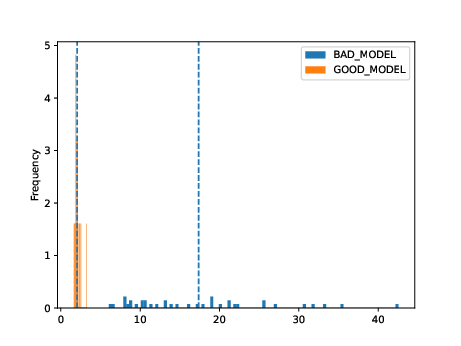

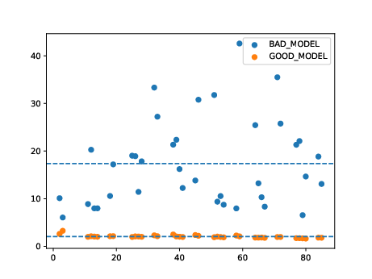
  

11. Obtain model interpretability scores
====================================

Model interpretability is often used for debugging purposes, by
allowing the user to "see" (to an extent) what a model is focusing on.
In this case, the tokens which contribute to a certain classification
are highlighted. The green colour indicates a classification towards
the target category, while the red colour indicates a classification
away from the target category. Colour intensity indicates the classification score.

.. ref to some famous interpretability examples
.. screenshot some html

In some scenarios, we can exploit this property by identifying 
regulatory regions or motifs in DNA sequences, or discovering amino
acid residues in protein structure critical to its function, leading 
to a deeper understanding of the underlying biological system.

.. code-block:: bash

    gzip -cd ../data/promoter.fasta.gz | \
      head -n10 > ../data/subset.fasta
    interpret \
      ../results/sweep_out/model_files \
      ../data/subset.fasta \
      -l PROMOTER NON-PROMOTER \
      -o ../results/model_interpret
    # -t TOKENISER_PATH, path to tokeniser.json file to load data
    # -o OUTPUT_DIR, specify path for output

.. code-block:: text

    ECK120010480 CSGDP1 REVERSE 1103344 SIGMA38.html
    ECK120010489 OSMCP2 FORWARD 1556606 SIGMA38.html
    ECK120010491 TOPAP1 FORWARD 1330980 SIGMA32 STRONG.html
    ECK120010496 YJAZP  FORWARD 4189753 SIGMA32 STRONG.html
    ECK120010498 YADVP2 REVERSE 156224  SIGMA38.html

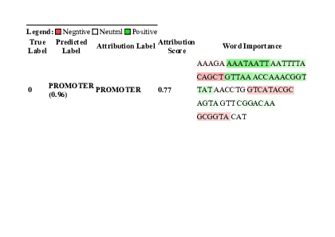

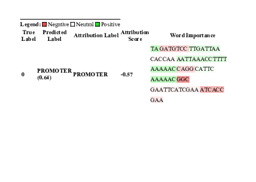

Citation
========

Cite our manuscript here::

  @article{chen2023genomicbert,
      title={genomicBERT and data-free deep-learning model evaluation},
      author={Chen, Tyrone and Tyagi, Navya and Chauhan, Sarthak and Peleg, Anton Y and Tyagi, Sonika},
      journal={bioRxiv},
      month={jun},
      pages={2023--05},
      year={2023},
      publisher={Cold Spring Harbor Laboratory},
      doi={10.1101/2023.05.31.542682},
      url={https://doi.org/10.1101/2023.05.31.542682}
  }

Cite our software here::

  @software{tyrone_chen_2023_8135591,
    author       = {Tyrone Chen and
                    Navya Tyagi and
                    Sarthak Chauhan and
                    Anton Y. Peleg and
                    Sonika Tyagi},
    title        = {{genomicBERT and data-free deep-learning model 
                    evaluation}},
    month        = jul,
    year         = 2023,
    publisher    = {Zenodo},
    version      = {latest},
    doi          = {10.5281/zenodo.8135590},
    url          = {https://doi.org/10.5281/zenodo.8135590} 
  }