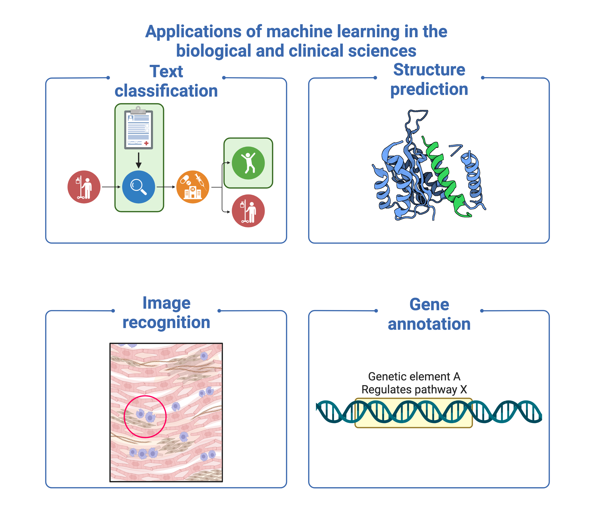
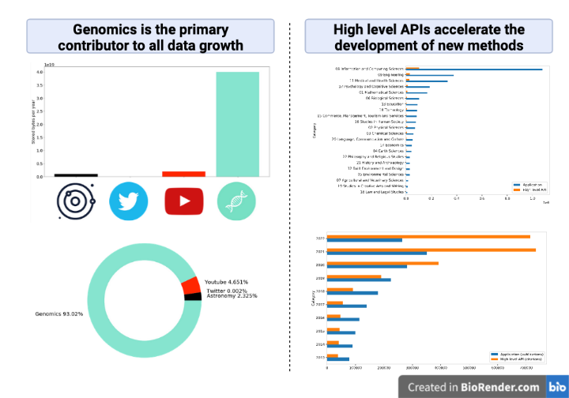
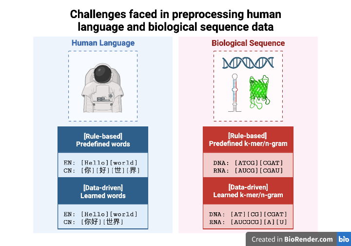
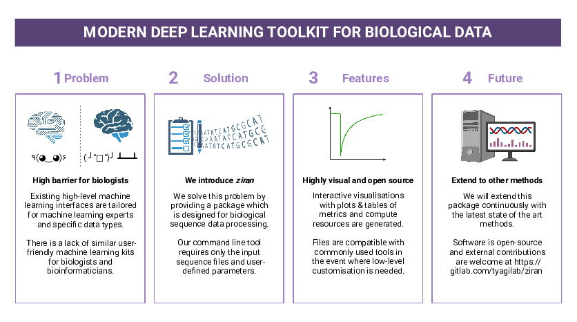

genomeNLP: Case study of deep learning
++++++++++++++++++++++++++++++++++++++

.. raw:: html

  Copyright (c) 2023 <a href="https://orcid.org/0000-0002-9207-0385">Tyrone Chen </a>, <a href="https://orcid.org/0000-0002-8797-3168">Navya Tyagi </a>, and <a href="https://orcid.org/0000-0003-0181-6258">Sonika Tyagi </a>.

Code in this repository is provided under a `MIT license`_. 
Documentation for this specific case study is provided with © all rights reserved (temporary until publication).
All other documentation not on this page is provided under a `CC-BY-3.0 AU license`_.

.. _MIT license: https://opensource.org/licenses/MIT

.. _CC-BY-3.0 AU license: https://creativecommons.org/licenses/by/3.0/au/

Outline
=======

The primary focus of this tutorial is application of NLP in a genomic
context by introducing our package ``genomenlp``. 
In this tutorial, we cover a wide range of topics from introduction
to field of GenomeNLP to practical application skills of our ``conda``
package, divided into various sections:

1.  Introduction to GenomeNLP
2.  Connection to a remote server
3.  Installing conda and genomenlp package
4.  Setting up a Biological Dataset
5.  Format a dataset as input for genomenlp
6.  Preparing a hyperparameter sweep
7.  Selecting optimal parameters
8.  With the selected hyperparameters, train the full dataset
9.  Performing cross-validation
10. Comparing performance of different models
11. Obtain model interpretability scores

For detailed usage of individual functions, please refer to the latest documentation.

Learning objectives
-------------------
- Describe the unique challenges in biological NLP compared to conventional NLP
- Understand common representations of biological data
- Understand common biological data preprocessing steps
- Investigate biological sequence data for use in machine learning
- Perform a hyperparameter sweep, training and cross-validation
- Identify what the model is focusing on
- Compare trained model performances to each other

.. NOTE::

  `This is **not** an introductory machine learning workshop. 
  Readers of this tutorial are assumed to be familiar with 
  the use of the command line and of the basics of machine learning.`

Potential/preferred prerequisite knowledge
------------------------------------------
- [required] CLI (e.g. bash shell) usage
- [optional] Connecting and working on a remote server (e.g. ``ssh``)
- [optional] Basic knowledge of machine learning
- [optional] Machine learning dashboards (e.g. ``tensorboard``, ``wandb``)
- [optional] Package/environment managers (e.g. ``conda``, ``mamba``)

Length: Half-day, 4.0 - 4.5 hours
Intended audience: machine learning practitioners OR computational biologists

Glossary
--------
- BERT - Bidirectional Encoder Representations from Transformers, a family of deep learning architectures used for NLP.
- DL - Deep Learning
- k-mers - Identical to tokens
- k-merisation - A process where a biological sequence is segmented into substrings. Commonly performed as a sliding window.
- ML - Machine Learning
- NLP - Natural Language Processing
- OOV - Out-of-vocabulary words 
- Sliding window - ABCDEF: [ABC, BCD, CDE, DEF] instead of [ABC, DEF]
- Tokenisation - A process where a string is segmented into substrings
- Tokens - Subunits of a string used as input into conventional NLP algorithms

1. Introduction
===============

What is NLP and genomics
------------------------

Natural Language Processing (NLP) is a branch of computer science
focused around the understanding of and the processing of human language. 
Such a task is non-trivial, due to the high variation in meaning
of words found embedded in different contexts. Nevertheless, NLP is applied
with varying degrees of success
in various fields, including speech recognition, machine translation and 
information extraction. A recent well-known example is ChatGPT.

Meanwhile, genomics involves the study of the genome, which contains 
the entire genetic content of an organism. As the primary blueprint, 
it is an important source of information and underpins all biological 
experiments, directly or indirectly.

Why apply NLP in genomics
-------------------------

Although NLP has been shown to effectively preprocess and extract "meaning" from
human language, until recently, its application in biology was mostly
centred around biological literature and electronic health record mining.
However, we note the striking similarities between genomic sequence data
and human languages that make it well-suited to NLP. 
(A) DNA can be directly expressed as human language, being composed of text 
strings such as A, C, T, G, and having its own semantics as well as grammar. 
(B) Large quantities
of biological data are available in the public domain, with a growth rate
exponentially exceeding astronomy and social media platforms combined.
(C) Recent advances in machine learning which improve the scalability of 
deep learning (DL) make computational analysis of genomic data feasible.

.. NOTE::

  `The same is true for protein sequences, and nucleic acid data such as 
  transcripts. While our pipeline can process any of these, the scope of
  this tutorial is for genomic data only.`

We therefore make a distinction between the field of conventional 
literature or electronic health record mining and the application of NLP 
concepts and methods to the genome. We call this field *genome NLP*.
The aim of *genome NLP* would be to extract relevant information from
the large corpora of biological data generated by experiments, such as
gene names, point mutations, protein interactions and biological pathways.
Applying concepts used in NLP can potentially enhance the analysis and 
interpretation of genomic data, with implications for research in
personalised medicine, drug discovery and disease diagnosis.

Distinction between conventional NLP and genome NLP
---------------------------------------------------

Several key differences need to be accounted for for implementing NLP on the genome. 
(A) The first challenge is the tokenisation of long biological sequences
into smaller subunits. While some natural languages have subunits 
separated by spaces, enabling easy segmentation, this is not
true in biological sequence data, and also to an extent in many 
languages such as Arabic, Mandarin or Sanskrit characters. (B) A second 
challenge is the diversity and high degree in nuance of biological 
experiments. As a result, interpretability and interoperability of 
biological data is highly restricted in scope, even within a single 
experiment. (C) The third challenge is the difficulty in comparing 
models, partly due to the second challenge, and partly due to the lack 
of accessible data in the biomedical field for privacy reasons, 
and partly because of the `limited enforcement of biological data integrity 
as well as metadata by journals`_. In addition, the large volume of biological 
data in a single experiment makes re-training time consuming.

.. _limited enforcement of biological data integrity as well as metadata by journals: https://academic.oup.com/view-large/figure/129641572/gky1064fig3.jpg

To address the challenges in genome-NLP, we used a new semi-automated workflow.
This workflow integrates feature engineering and machine
learning techniques and is designed to be adaptable across different
species and biological sequences, including nucleic acids and proteins. 
The workflow includes the introduction of a (1) new tokeniser for
biological sequence data which effectively tokenises contiguous genomic 
sequences while retaining biological context. This minimises
manual preprocessing, reduces vocabulary sizes, and (2) handles unknown
biological terms, conceptually identical to the out-of-vocabulary (OOV)
problem in natural languages. (3) Passing the preprocessed data to a 
``genomicBERT`` algorithm allows for direct biological sequence input
to a state-of-the-art deep learning algorithm. (4) We also enable model
comparison by weights, removing the need for computationally expensive
re-training or access to raw data. To promote collaboration and adoption, 
``genomicBERT`` is available as part of the publicly accessible conda 
package called ``genomeNLP``. `Successful case studies`_ have demonstrated 
the effectiveness of ``genomeNLP`` in ``genome NLP`` applications.

.. _Successful case studies: https://doi.org/10.5281/zenodo.8135590

2. Connect to a remote server
=============================

To standardise the compute environment for all participants, we will be 
establishing a network connection with a remote server. Data and a working
install of ``genomenlp`` is provided. Secure Shell (SSH) is a common method 
for remote server connection, providing secure access and remote command 
execution through encrypted connections between the client and server.

To use ``ssh`` (Secure Shell) for remote server access, please follow these steps:

1. Open a Terminal or Command Prompt on your local machine. SSH is
   typically available on Unix-like systems (e.g. Linux, macOS) and
   can also be installed on Windows systems using tools like
   `PuTTY <https://www.chiark.greenend.org.uk/~sgtatham/putty/latest.html>`__
   or `MobaXterm <https://mobaxterm.mobatek.net/download.html>`__.

2. Determine the ``ssh`` command syntax. Generally the format is:
   ``ssh username@hostname`` or the IP address of the remote server.

3. Enter your password or passphrase when prompted. Once authenticated,
   you should be connected to the remote server via SSH.

.. NOTE::

  `Details for (2) and (3) will be provided on the day of the workshop.`

3. Installing conda, mamba and genomenlp
========================================

.. NOTE::

  `This step is already performed for you. Information is provided as 
  a guide for those who are reading this document outside of the 
  tutorial, or if for some reason the installation is not working.`

A package/environment manager is a software tool that automates the
installation, update, and removal of packages and allows for the
creation of isolated environments with specific configurations. This
simplifies software setup, reduces compatibility issues, and improves
software development workflows. Popular examples include ``apt`` and 
``anaconda``. We will use ``conda`` and ``mamba`` in this case study.

.. NOTE::

  `The same is true for protein sequences, and nucleic acid data such as 
  transcripts. While our pipeline can process any of these, the scope of
  this tutorial is for genomic data only.`

To install ``conda`` using the command line, you can follow these steps:

1. Open your command prompt. Use the ``curl`` or ``wget`` command to 
   download the installer directly from the command line using its URL.

.. code-block:: bash

     $ wget 'https://repo.anaconda.com/miniconda/Miniconda3-py39_23.3.1-0-Linux-x86_64.sh'

2. Run the installer script using the following command:

.. code-block:: bash

     $ bash Miniconda3-py39_23.3.1-0-Linux-x86_64.sh

3. Follow the on-screen prompts to proceed with the installation. (In the prompt asking
   for the location for ``conda`` installation, please specify the directory as ``foo/bar``)

4. Reload your ``shell`` as shown below OR exit and return to complete the install.

.. code-block:: bash

     $ source ~/.bashrc
     $ source ~/.bash_profile

5. To install ``mamba``, which is a faster alternative to Conda for package management,
   run the following command:

.. code-block:: bash

    $ conda install mamba -n base -c conda-forge

.. NOTE::

  *`pip` does not work due to a missing pytorch dependency.
  `conda` was found to be very slow due to the large dependency tree.*

6. As with Step 4, reload your shell as below OR exit and return to complete the install.

.. code-block:: bash

    $ source ~/.bashrc
    $ source ~/.bash_profile

7. To install and activate ``genomenlp``, run the following commands:

.. code-block:: bash

    $ mamba create -n genomenlp -c tyronechen -c conda-forge genomenlp -y
    $ mamba activate genomenlp
    # after the above completes
    $ sweep -h
    # you should see some output

Case studies per molecule type
==============================

Please select the case study relevant to your use case:

DNA case study
--------------

:doc:`case_study_dna`

RNA case study
--------------

*coming soon*

Protein case study
------------------

:doc:`case_study_protein`

Citation
========

Cite our manuscript here::

  @article{chen2023genomicbert,
      title={genomicBERT and data-free deep-learning model evaluation},
      author={Chen, Tyrone and Tyagi, Navya and Chauhan, Sarthak and Peleg, Anton Y and Tyagi, Sonika},
      journal={bioRxiv},
      month={jun},
      pages={2023--05},
      year={2023},
      publisher={Cold Spring Harbor Laboratory},
      doi={10.1101/2023.05.31.542682},
      url={https://doi.org/10.1101/2023.05.31.542682}
  }

Cite our software here::

  @software{tyrone_chen_2023_8135591,
    author       = {Tyrone Chen and
                    Navya Tyagi and
                    Sarthak Chauhan and
                    Anton Y. Peleg and
                    Sonika Tyagi},
    title        = {{genomicBERT and data-free deep-learning model 
                    evaluation}},
    month        = jul,
    year         = 2023,
    publisher    = {Zenodo},
    version      = {latest},
    doi          = {10.5281/zenodo.8135590},
    url          = {https://doi.org/10.5281/zenodo.8135590} 
  }