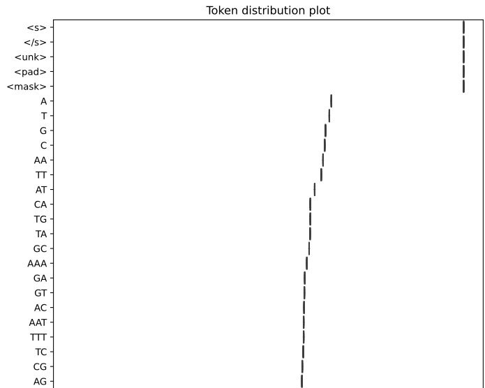
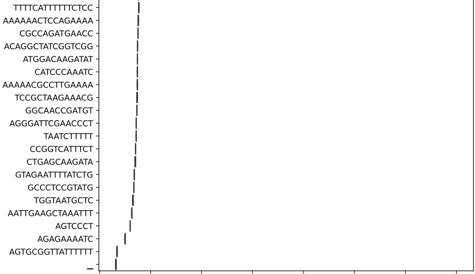
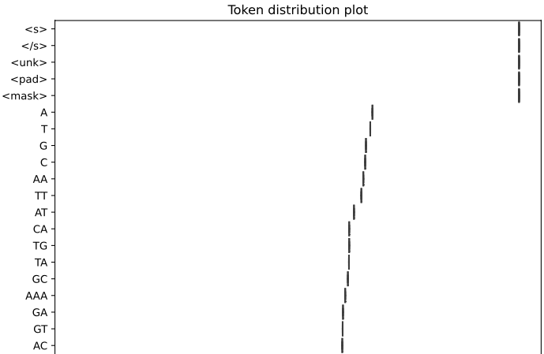
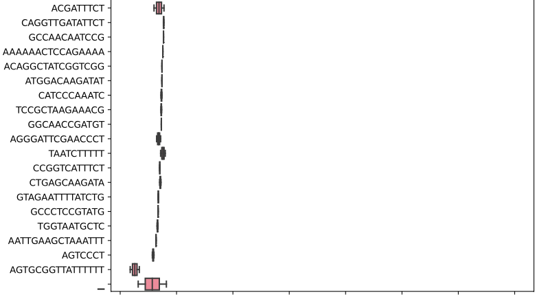
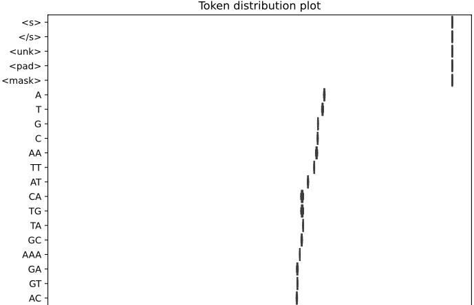
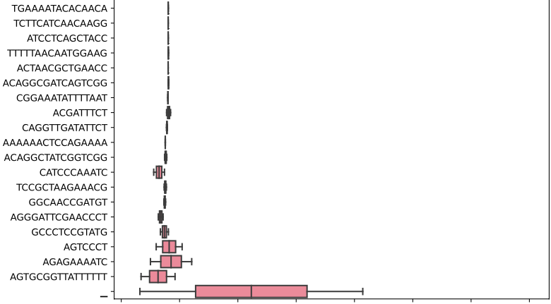

Create a token set from sequences
=================================

This explains the use of ``kmerise_bio.py`` and ``tokenise_bio.py``. In ``tokenise_bio.py`` we empirically derive tokens from biological sequence data which can be used in downstream applications such as ``genomicBERT``.

Source data
-----------

Any ``fasta`` file can be used (nucleic acid or protein).

Results
-------

.. NOTE::

  Entry points are available if this is installed using the automated conda method. You can then use the command line argument directly, for example: ``create_dataset_bio``. If not, you will need to use the script directly, which follows the same naming pattern, for example: ``python create_dataset_bio.py``.

Running the code as below:

Empirical tokenisation
++++++++++++++++++++++

::

  python tokenise_bio.py -i [ INFILE_PATH ... ] -t TOKENISER_PATH

You will obtain a ``json`` file with weights for each token. Any special tokens you add will also be present. This will be used in the next step of creating a ``HuggingFace`` compatible dataset object.

Conventional k-mers
+++++++++++++++++++

::

  python kmerise_bio.py -i [INFILE_PATH ... ] -t TOKENISER_PATH -k KMER_SIZE -l [LABEL ... ] -c CHUNK -o OUTFILE_DIR

For k-mers, ``HuggingFace``-like dataset files will be written to disk in the same operation. This can be loaded directly into a "conventional" deep learning pipeline.

However, the file is not split into partitions. You can use it directly if you already have other partitions corresponding to training, testing and validation data. If not, you will need to create a dataset in the next stage, using the ``tokeniser.json`` file generated in this step. 

Notes
-----

Please refer to `HuggingFace tokenisers`_ for more detailed information:

.. _HuggingFace tokenisers: https://github.com/huggingface/tokenizers

Usage
-----

Empirical tokenisation
++++++++++++++++++++++

For empirical tokenisation, the next step is to run ``create_dataset_bio.py``. Reverse complementing ``Y/R`` is supported.

::

  python tokenise.py -h
  usage: tokenise.py [-h] [-i INFILE_PATHS [INFILE_PATHS ...]] [-t TOKENISER_PATH]
                     [-s SPECIAL_TOKENS [SPECIAL_TOKENS ...]] [-e EXAMPLE_SEQ]

  Take gzip fasta file(s), run empirical tokenisation and export json.

  options:
    -h, --help            show this help message and exit
    -i INFILE_PATHS [INFILE_PATHS ...], --infile_paths INFILE_PATHS [INFILE_PATHS ...]
                          path to files with biological seqs split by line
    -t TOKENISER_PATH, --tokeniser_path TOKENISER_PATH
                          path to tokeniser.json file to save or load data
    -v VOCAB_SIZE, --vocab_size VOCAB_SIZE
                          select vocabulary size (DEFAULT: 32000)
    -b BREAK_SIZE, --break_size BREAK_SIZE
                          split long reads, keep all by default (DEFAULT: None)
    -c CASE, --case CASE  change case, retain original by default (DEFAULT: None)
    -s SPECIAL_TOKENS [SPECIAL_TOKENS ...], --special_tokens SPECIAL_TOKENS [SPECIAL_TOKENS ...]
                          assign special tokens, eg space and pad tokens 
                          (DEFAULT: ["<s>", "</s>", "<unk>", "<pad>", "<mask>"])
    -e EXAMPLE_SEQ, --example_seq EXAMPLE_SEQ
                          show token to seq map for a sequence (DEFAULT: None)

        usage: compare_empirical_tokens.py [-h] [-t TOKENISER_PATH] [-w TOKEN_WEIGHT] [-m MERGE_STRATEGY]
                                   [-p POOLING_STRATEGY] [-o OUTFILE_PATH]
                                   infile_paths [infile_paths ...]

  # supplementary script for evaluating tokenisation performance across contig lengths or sequence subsets
  python compare_empirical_tokens.py -h
  usage: compare_empirical_tokens.py [-h] [-t TOKENISER_PATH] [-w TOKEN_WEIGHT] [-m MERGE_STRATEGY]
                                   [-p POOLING_STRATEGY] [-o OUTFILE_PATH]
                                   infile_paths [infile_paths ...]
  Take token json files, show intersection and weight variance.

  positional arguments:
    infile_paths          path to tokeniser files generated by tokenise_bio

  optional arguments:
    -h, --help            show this help message and exit
    -t TOKENISER_PATH, --tokeniser_path TOKENISER_PATH
                          path to pooled tokeniser (DEFAULT: pooled.json)
    -w TOKEN_WEIGHT, --token_weight TOKEN_WEIGHT
                          path to output file showing token weights status
    -m MERGE_STRATEGY, --merge_strategy MERGE_STRATEGY
                          merge tokens using [ inner | outer ] (DEFAULT: None)
    -p POOLING_STRATEGY, --pooling_strategy POOLING_STRATEGY
                          pool tokens using [ mean | median | max | min ] (DEFAULT: None)
    -o OUTFILE_PATH, --outfile_path OUTFILE_PATH
                          path to output boxplot showing token weights distribution

Handling long reads
*******************

The original word segmentation algorithm was designed for sentences in human language. In biology, a chromosome can be formulated as a single sentence. In such cases, empirical tokenisation breaks if a sequence length of greater than ~3-4 Mbp is provided.

Since there is a limit to sequence length, here we explore the feasability of subsampling sequences as a workaround. We obtain a small genome which can be tokenised fully as a control, and split its genome into different contig lengths to get a collection of smaller sequences. We then compare the (a) empirical token weights and (b) token identity across different contig lengths.

We choose the *Haemophilus influenzae* genome since it can be fully tokenised::

  #!/bin/sh
  # download Haemophilus influenzae genome
  curl -OJX GET "https://api.ncbi.nlm.nih.gov/datasets/v2alpha/genome/accession/GCF_000931575.1/download?include_annotation_type=GENOME_FASTA,GENOME_GFF,RNA_FASTA,CDS_FASTA,PROT_FASTA,SEQUENCE_REPORT&filename=GCF_000931575.1.zip" -H "Accept: application/zip"
  unzip GCF_000931575.1.zip
  cp ncbi_dataset/data/GCF_000931575.1/GCF_000931575.1_ASM93157v1_genomic.fna ./
  gzip GCF_000931575.1_ASM93157v1_genomic.fna

We split the genome into different contig lengths spanning 2**9 to 2**20, and retain the full genome as a control::

  # NOTE: this will take some time!
  # 0 for ground truth
  for len in 0 512 1024 2048 4096 8192 16384 32768 65536 131072 262144 524288 1048576; do
    tokenise_bio \
    -i GCF_000931575.1_ASM93157v1_genomic.fna.gz \
    -v 10000 \
    -t tokens_contigs.${len}.10000.json \
    -c upper \
    -b ${len}

  # you will see the tokeniser files generated as a result
  ls *10000.json

Next, we examine the token weights for each contig length compared to the whole genome. Token weights and outliers are exported, along with a boxplot showing variance of the weight distribution::

  # compare the ground truth tokens vs each contig length
  for i in *json; do 
    compare_empirical_tokens \
      tokens_contigs.0.10000.json \
      $i \
      -t ${i}.tsv \
      -o ${i}.pdf 
  done

  # compare all contig lengths together
  compare_empirical_tokens *json -t all.tsv -o all.pdf

.. NOTE::

  You can use ``compare_empirical_tokens`` with any combination of ``json`` files as a quality control metric on your own data. We suggest a contig length of 1M as an upper limit.::

We examine the results and observe two key patterns:
- Token weight variance from ground truth decreases with longer contigs
- Token identity overlap with ground truth increases with longer contigs

However, the variance in weight and identity overlap is not extremely large, even with very short contigs. Across different contig lengths, lower weighted tokens tend to be more variable, while highly weighted tokens are more stable.

Token set identity per contig length:

=============  =================  ===================
Contig length  Token overlap      Percentage identity
=============  =================  ===================
  0              10000 (control)    100.00
  512            7570               75.70          
  1024           8131               81.31
  2048           8585               85.85
  4096           8849               88.49
  8192           9057               90.57
  16384          9196               91.96
  32768          9349               93.49
  65536          9422               94.22
  131072         9512               95.12
  262144         9593               95.93
  524288         9618               96.18
  1048576        9674               96.74
=============  =================  ===================

Due to size, only a subset of plots are shown for reference. The full plots can be generated from the above code.

Full genome length (highest weighted tokens):

Full genome length (lowest weighted tokens):

Long contigs 1048576 bp (highest weighted tokens):

Long contigs 1048576 bp (lowest weighted tokens):

Short contigs 512 bp (highest weighted tokens):

Short contigs 512 bp (lowest weighted tokens):

Pooling multiple tokenisers
***************************

If you want to pool multiple tokenisers, you can use ``compare_empirical_tokens`` with additional options ``-m`` for ``inner`` or ``outer`` merge, and ``-p`` for ``min``, ``max``, ``mean``, ``median`` weight pooling.

Conventional k-mers
+++++++++++++++++++

Note that this step also generates a dataset object in the same operation. Reverse complementing ``Y/R`` is supported.

Here we take a list of infile paths, and a list of matching labels. Eg ``--infile_path file1.fasta file2.fasta``, then ``--label 0 1``.

::

  python ../src/kmerise_bio.py -h
  usage: kmerise_bio.py [-h] [-i INFILE_PATH [INFILE_PATH ...]]
                        [-o OUTFILE_PATH] [-c CHUNK] [-m MAPPINGS]
                        [-t TOKENISER_PATH] [-k KMER_SIZE]
                        [-l LABEL [LABEL ...]] [--no_reverse_complement]

  Take gzip fasta file(s), kmerise reads and export csv.

  options:
    -h, --help            show this help message and exit
    -i INFILE_PATH [INFILE_PATH ...], --infile_path INFILE_PATH [INFILE_PATH ...]
                          path to files with biological seqs split by line
    -o OUTFILE_PATH, --outfile_path OUTFILE_PATH
                          path to output huggingface-like dataset.csv file
    -c CHUNK, --chunk CHUNK
                          split seqs into n-length blocks (DEFAULT: None)
    -m MAPPINGS, --mappings MAPPINGS
                          path to output mappings file
    -t TOKENISER_PATH, --tokeniser_path TOKENISER_PATH
                          path to tokeniser.json file to save data
    -k KMER_SIZE, --kmer_size KMER_SIZE
                          split seqs into n-length blocks (DEFAULT: None)
    -l LABEL [LABEL ...], --label LABEL [LABEL ...]
                          provide integer label for seqs (order must match
                          infile_path!)
    --no_reverse_complement
                          turn off reverse complement (DEFAULT: ON)
